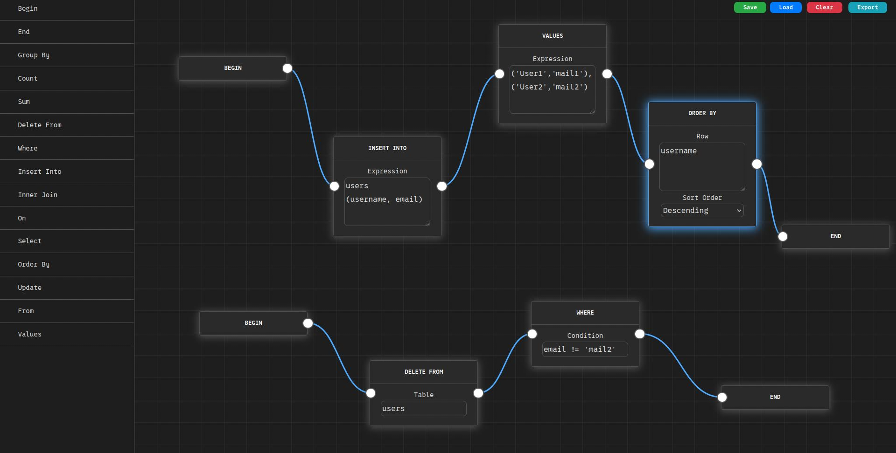
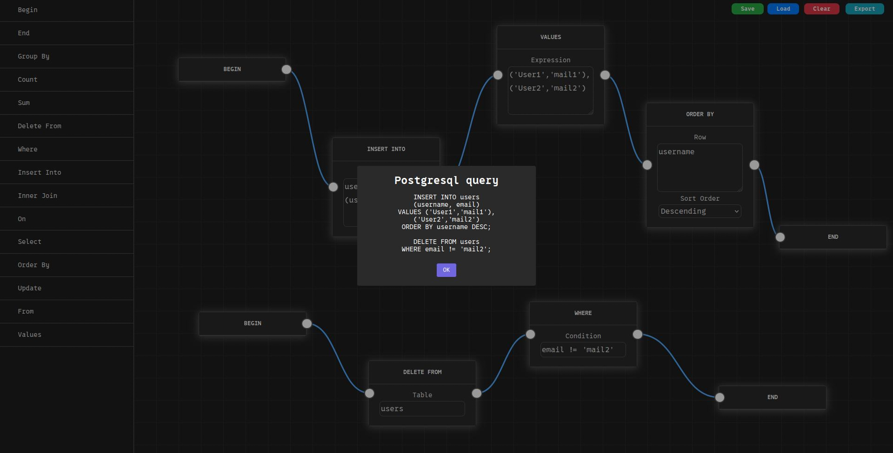

<!-- :toc: macro -->
<!-- :toc-title: -->
<!-- :toclevels: 99 -->

# nodeDB <!-- omit from toc -->

> A visual node-based editor for building and composing PostgreSQL queries dynamically.
> Live demo [_here_](https://lurkydismal.github.io/nodeDB).

## Table of Contents <!-- omit from toc -->

* [General Information](#general-information)
* [Technologies Used](#technologies-used)
* [Features](#features)
* [Screenshots](#screenshots)
* [Setup](#setup)
* [Usage](#usage)
* [Project Status](#project-status)
* [Room for Improvement](#room-for-improvement)
* [Acknowledgements](#acknowledgements)
* [Contact](#contact)
* [License](#license)

## General Information

nodeDB is a browser‑based, drag‑and‑drop node editor that generates PostgreSQL queries without typing SQL by hand. It solves the problem of constructing complex queries visually and exporting them for execution. Currently focused on PostgreSQL export, with MongoDB export planned for the future. Queries and node layouts are saved to and restored from browser storage, so you never lose your work.

## Technologies Used

* Drawflow — v0.0.60
* SweetAlert2 — v11
* Vanilla JavaScript, HTML, and CSS
* Browser Local Storage API

## Features

* Build queries by connecting nodes representing SQL clauses ( SELECT, FROM, WHERE, GROUP BY, etc. )
* Save and restore your node graph in browser storage
* One‑click export of composed query to a .sql text blob via the “Export” button
* Customizable node definitions — add new node types by editing the nodes array in index.html
* Lightweight, no build step or server required — just open index.html in your browser

## Screenshots




## Setup

No build or installation is required:

1. Clone the repo
    ```bash
    git clone https://github.com/lurkydismal/nodeDB.git
    ```

1. Open index.html in your favorite browser ( tested on Firefox 138.0.3 ).
    That’s it — everything runs client‑side.

## Usage

1. Edit or extend the nodes array in index.js to add new node types. Example node:
    ```js
    {
      name: "group_by",        // will also define a CSS class for styling
      label: "Group By",       // displayed in the node header
      io: [1, 1],              // one input, one output
      data: { keyForInput: "", groups: "" },
      psql: "GROUP BY $groups\n",
      input: ["Label", "keyForInput"],      // single-line text field
      textarea: ["Groups", "groups"],       // multi-line textarea
      select: [
          "Select something", "keyInData",
          [
              [ "Option label", "option_value" ],
              [ "Another option label", "another_option_value" ]
          ]
      ], // select list
    }
    ```

1. Drag nodes onto the canvas, fill in parameters, and connect edges.
1. Click Export ( top-right ) to generate the final SQL query. A SweetAlert2 modal will display your assembled query, preserving newlines.
1. Copy the SQL and run it in psql or your preferred client.

## Project Status

Project is in progress. Core PostgreSQL node editor functionality is complete; MongoDB export and additional node types are planned next.

## Room for Improvement

To do:

* Implement MongoDB query export based on the same node graph
* Add more node types ( e.g., LEFT JOIN, HAVING, LIMIT )

## Acknowledgements

* Inspired by the [_Drawflow demo_](https://github.com/jerosoler/Drawflow/blob/master/docs/index.html).
* SweetAlert2 for lightweight, customizable modals

## Contact

Created by [@lurkydismal](https://github.com/lurkydismal) - feel free to contact me!

## License

This project is open source and available under the
[GNU Affero General Public License v3.0](https://github.com/lurkydismal/nodeDB/blob/main/LICENSE).
